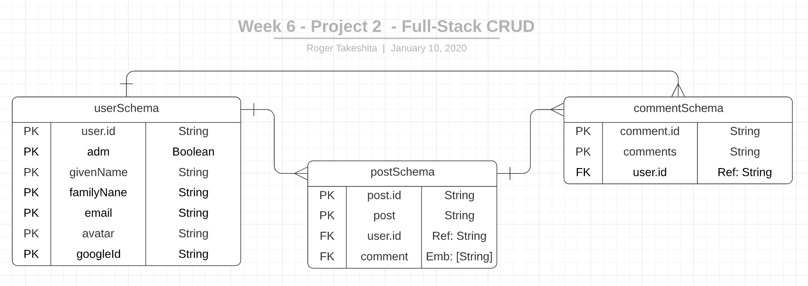
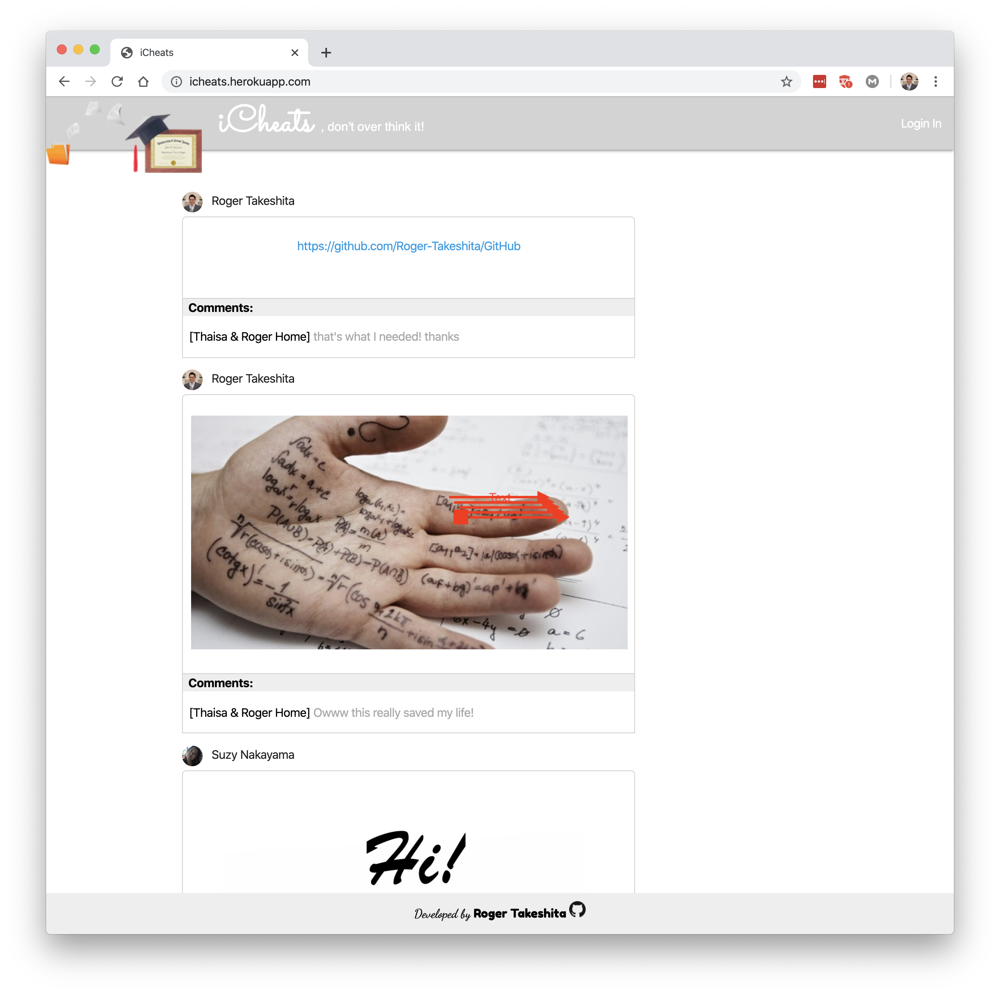
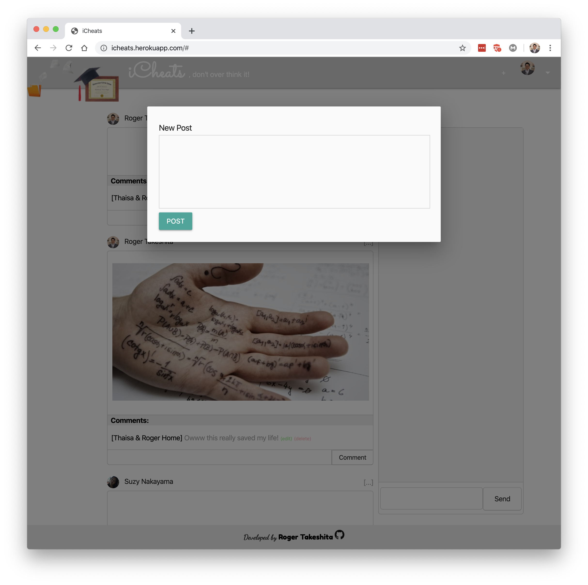
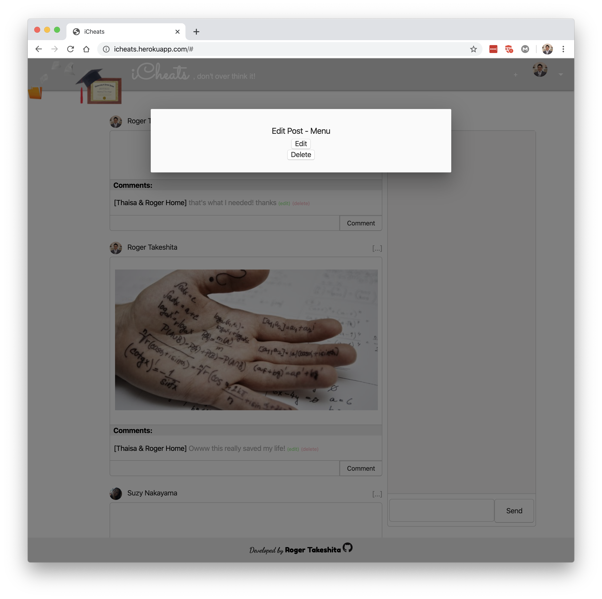
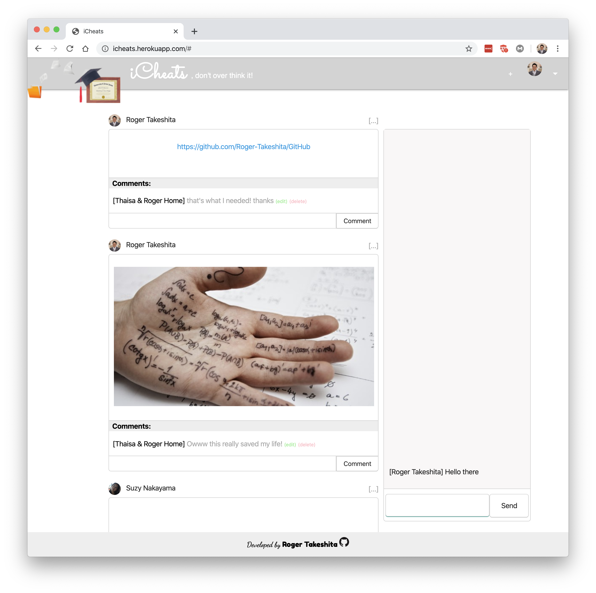

<h1><a href="https://icheats.herokuapp.com/">iCheats, don't over think it!</a></h1>

* [iCheats Website](https://icheats.herokuapp.com/)

* Summary:
  * Database - MongoDB (no SQL database)
  * Server - Express Framework
  * Front-end/Back-end: JavaScript
  * Front-end: Html
  * Front-end: Css
  * API where it returns data resources as JSON
  * Socket.io - Realtime communication (chat)
  * Deploying Using Heroku

<h2 id='fun'>Fun Facts</h2>

[Go Back to Summary](#summary)

* A new way to get insights when you don't know anything.
* [iCheats](https://icheats.herokuapp.com/) is a social media for **students** to ask for help when even Jesus can't help you.

<h1 id='summary'>Summary</h1>

* [Planning & Presentation Requirements](#planning-presentation)
  * [Planning](#planning)
* [Technologies Used](#tech)
  * [Used Packages](#used)
* [Getting Started](#getting)
* [Next Steps](#next)

<h1 id='planning-presentation'>Planning & Presentation Requirements</h1>

<h2 id='planning'>Planning</h2>

[Go Back to Summary](#summary)

* [Trello Board Link](https://trello.com/b/hjQivuL9/w06-project-2-full-stack-crud)

* [Entity Relationship Diagram](https://www.lucidchart.com/invitations/accept/c13fbcbb-60fd-49a1-b465-ec39d52178bf)

   

<h1 id='tech'>Technologies Used</h1>

[Go Back to Summary](#summary)

* JavaScript
* CSS
* HTML

<h2 id='used'>Used Packages</h2>

[Go Back to Summary](#summary)

   ```Bash
      npx express-generator -e
      npm i
      npm i dotenv
      npm i cors
      npm i express-session
      npm i passport
      npm i passport-google-oauth
      npm i socket.io
      npm i method-override
   ```

<h1 id='gettting'>Getting Started</h1>

[Go Back to Summary](#summary)

1. Access [iCheats](https://icheats.herokuapp.com/)

2. Login
   

3. Crate a new post




3. Edit or delete a post



4. Add a new comment, edit or delete.
   


5. API to `GET` all posts:
   * [https://icheats.herokuapp.com/api/posts](https://icheats.herokuapp.com/api/posts)

6. API to `GET` a single post:
   * [https://icheats.herokuapp.com/api/posts/5e180227c9ff780017ce2276](https://icheats.herokuapp.com/api/posts/5e180227c9ff780017ce2276)

7. API to `GET` all posts from a single user:
   * [https://icheats.herokuapp.com/api/posts/user/5e1790cdc3fa270017358c88](https://icheats.herokuapp.com/api/posts/user/5e1790cdc3fa270017358c88)
  
<h1 id='next'>Next Steps</h1>

[Go Back to Summary](#summary)

* Upload files (images and files) to the server.
* Create a dedicated 1 to 1 realtime chat
* Save all the history chat in monogoDB
* Refresh comments/posts refreshing the whole page.
* Create a profile for each user (The user will be able to edit their info) and view all his posts.
